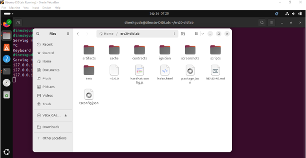
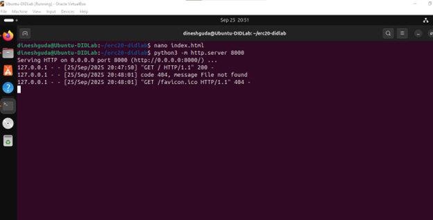
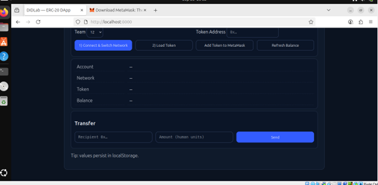
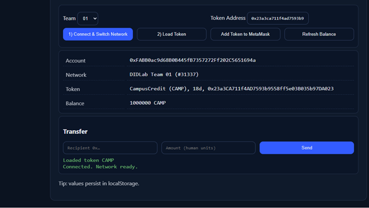
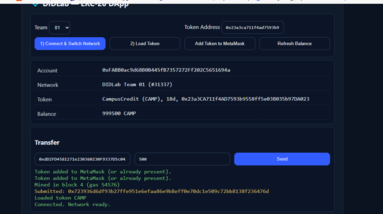

# Assignment 4 — Minimal DApp (ERC-20 on DIDLab)

> **Note:** I originally attempted to deploy on **Team 12’s DIDLab link**, but it was not working smoothly with ERC-20 transactions. Therefore, I switched to **Team 1’s DIDLab chain** for this submission.

---

## 1. Project Setup

I created a new folder called `erc20-didlab`. Inside it, I added the `index.html` file, which contains all the code for the DApp. This single file is responsible for the UI and logic that connects to MetaMask, switches to the DIDLab test network, and interacts with my ERC-20 token.

Here’s the folder structure showing the `index.html` file:  


---

## 2. Running the Local Server

To serve the file locally, I used Python’s built-in HTTP server with the following command:

```bash
python3 -m http.server 8000
```

This started a local server at `http://localhost:8000`.  


---

## 3. Connecting to MetaMask

When I opened the DApp in my browser, the first step was to click **Connect & Switch Network**. This triggered MetaMask to request permission to connect and switch to the DIDLab Team 1 network.  



---

## 4. Loading the Token

After connecting my account, I entered the token address into the DApp and clicked **Load Token**. MetaMask confirmed the action, and the DApp successfully displayed the token’s details: **name, symbol, and decimals**.  



---

## 5. Viewing Balance

Once the token was loaded, the DApp displayed:  
- My account address  
- The DIDLab network ID  
- The token contract address  
- My current token balance  


---

## 6. Token Transfer

I tested the transfer function by sending **500 CAMP** tokens to another account. The transaction was mined in block 4, and my balance updated from 1,000,000 CAMP to **999,500 CAMP**.  



---

## Troubleshooting Notes

During the implementation, I encountered a few issues and their solutions:  

- If nothing happened on connect → ensure MetaMask is installed and enabled.  
- If the network was wrong → approve the DIDLab network switch prompt.  
- If `Returned no data (0x)` appeared → the token address was invalid or not deployed on that chain.  
- If `Insufficient funds` appeared → import the faucet private key or transfer tokens to the account.  

---

## Conclusion

By the end of this assignment, I had a fully working **Minimal DApp** that can:  
- Connect with MetaMask  
- Switch to the correct DIDLab test network  
- Load and display ERC-20 token metadata  
- Show my token balance  
- Transfer tokens between accounts  
- Add the token to MetaMask  

This assignment helped me understand how a simple single-file DApp can interact with a blockchain and wallet extension in a practical way.  
